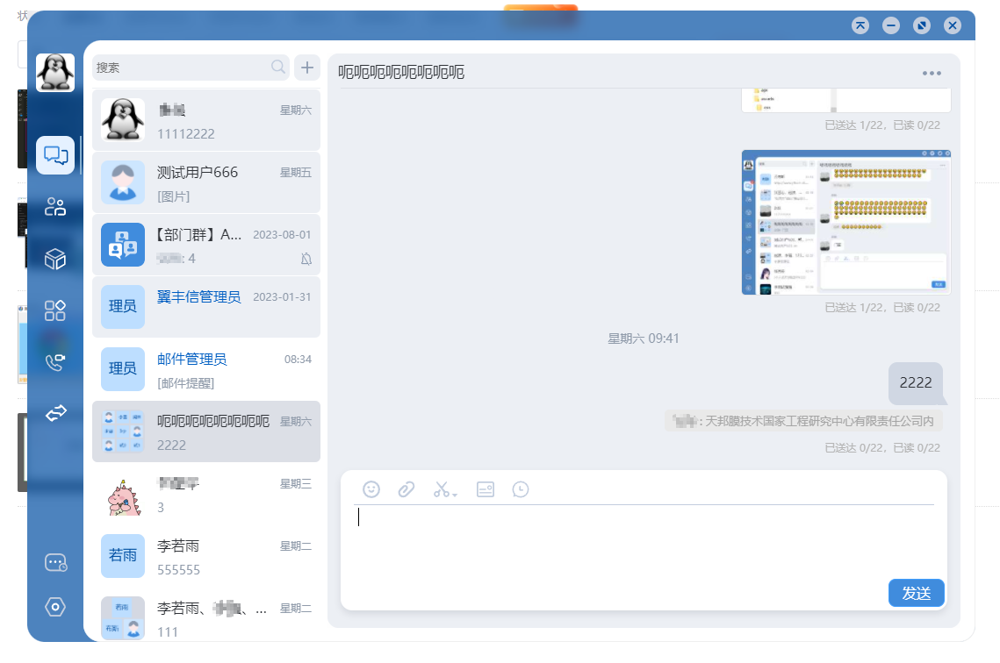

# electron-vibrancy-windows

#### 介绍
适用于win10和win7的electron使用的毛玻璃窗口特效


#### 软件架构
Since this is a native addon, you will need your platforms build tools. Visual Studio etc. Also Python for `node-gyp`.

```
git clone https://gitee.com/lykiao/electron-vibrancy-windows.git
cd electron-vibrancy-windows
yarn install
cd spec/app # 进入示例
electron . # electron --version 版本应该为 15.3.5
```

#### 支持平台
Windows 7、Windows 10 (stable) 64位

#### 再编译

参照package.json或readme，执行以下命令，生成release版本Vibrancy.node文件
```
yarn conf
yarn rebuild
```

#### 使用说明

1.  指定electron版本及node版本，再编译，生成Vibrancy.node文件
2.  复制文件【\vibrancy\index.js】并改名为例如【vibrancy.js】，将第一行【var Vibrancy = require('bindings')('Vibrancy');】改为【var Vibrancy = require('../Vibrancy.node');】，具体路径根据实际修改
3. 然后就可以在background.js中引入并使用了：
background.js引入例：
const electronVibrancy = require("./vibrancy");
background.js中使用例：
electronVibrancy.enableVibrancy(mainWindow);
electronVibrancy.disableVibrancy(mainWindow);

以上是我直接引入Vibrancy.node文件的使用方式，或者也可以参照本工程例（spec/app）的引入方式：
```
// mainWindow with show: false
mainWindow.on('ready-to-show',function() {
  var electronVibrancy = require('..');
  
  electronVibrancy.enableVibrancy(mainWindow);

  electronVibrancy.disableVibrancy(mainWindow);

  mainWindow.show();
});

```

### 效果图


### 注意事项
1. `BrowserWindow` 必须定义为透明 (`transparent:true`)
2. 编译时node版本需要同electron版本对应的node版本一致
3. 关于原代码编译错误：
其中Vibrancy.cc的61行编译报错，有修改，以下代码的括号中添加isolate解决：
bool toggleState = toggleStateObj->BooleanValue(isolate);


## API
There are several methods depending on what you want to do and what platform you are on.

### `enableVibrancy(window)` _win_

Returns `Bool`.

* `window` `BrowserWindow` instance

Enables or disables vibrancy for the **WHOLE** window.

### `disableVibrancy(window)` _win_

Disables Vibrancy completely.

* `window` `BrowserWindow` instance


## Platform notice

On **Windows 10** the addon uses ```SetWindowCompositionAttribute```, which is an undocumented API, which means it can be changed by Microsoft any time and break the functionality.

## License

This project is under MIT.
See [LICENSE](https://github.com/levrik/electron-vibrancy-windows/blob/master/LICENSE)
